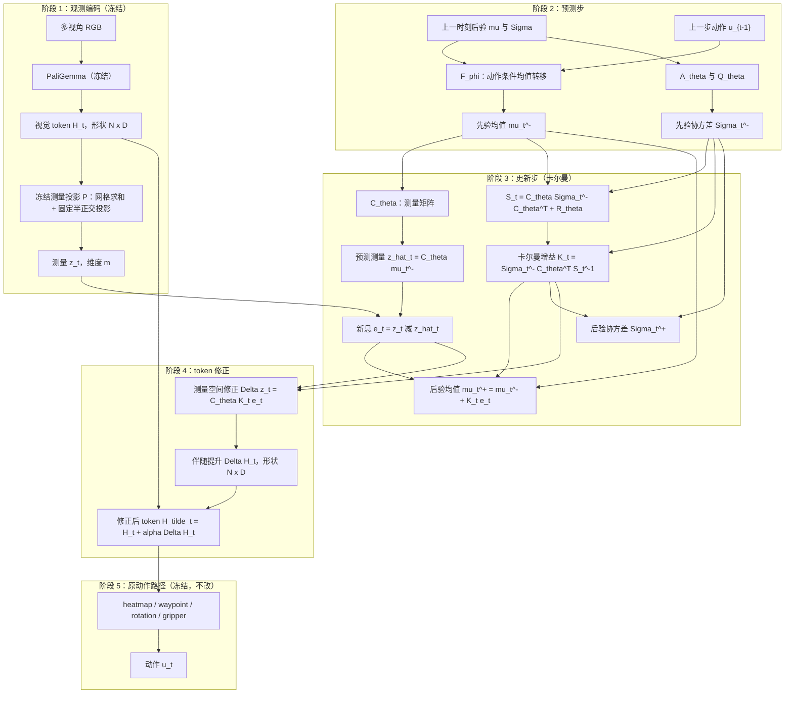
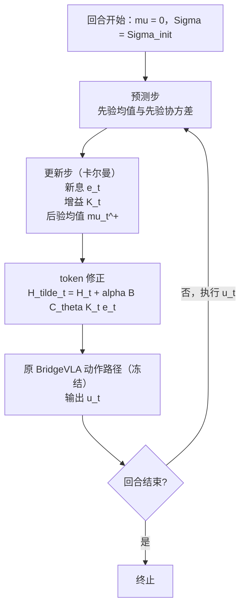

# BridgeVLA 滤波器式 token correction 设计

> 状态：**方法设计已定稿；代码已接入并通过端到端训练验证；首次 400 步 smoke 查出两处尺度设定缺陷，尚未修复，因此目前没有任何性能证据。**
>
> 阅读顺序建议：§1–§3 方法设计 → §5 流程 → §10.2 离线验证结果 → §11.5 smoke 诊断。工程状态、复现命令、踩坑清单与下一步顺序见 [`bridgevla_filter_token_correction_handoff.md`](bridgevla_filter_token_correction_handoff.md)。

## 1. 前提与目标

### 1.1 硬约束

1. 冻结 PaliGemma；
2. 冻结 BridgeVLA 原有的 heatmap、waypoint、rotation、gripper 等动作模块；
3. 不引入第二个大型视觉主干，不生成视频，不做候选动作推演或规划；
4. 只输出一个 token 残差 $\Delta H_t$，再交回原动作路径。

原始数据流保持不变：

$$
H_t=\operatorname{PaliGemma}(o_t,l),
\qquad
\widetilde H_t=H_t+\Delta H_t,
\qquad
u_t=\pi_{\mathrm{BridgeVLA}}(\widetilde H_t),
$$

其中 $\pi_{\mathrm{BridgeVLA}}$ 完全保留。

### 1.2 要回答的问题

> 在不改原动作解码器的前提下，**什么证据决定 token 往哪个方向修正，修正幅度又该由什么决定？**

本文的答案：方向由**新息**（innovation）决定，幅度由**卡尔曼增益**决定，可训练的只是滤波器模型本身。

## 2. 核心思想

### 2.1 现有做法的问题

现有实现为

$$
y_t^-=F_\phi(y_{t-1}^+,u_{t-1}),
\qquad
y_t^+=U_\omega(y_t^-,H_t),
\qquad
\Delta H_t=A_\psi(H_t,y_t^+).
$$

它有三处不符合滤波语义：

1. **没有新息。** `observation_decoder.py` 的 $D_\eta$ 预测当前视觉表征，但预测值从未与当前观测**相减**，模型因此不知道"自己预测错了多少"，$H_t$ 只被吸收、不被比较。
2. **没有增益。** `transition.py` 与 `observation_update.py` 都只传播点估计、不带协方差，"这一刻该多信观测还是多信预测"无从计算。
3. **状态只是全局偏置。** `token_correction.py:99` 把状态广播到该时刻的所有 token，即同一时刻每个 token 加同一个向量，无法表达"哪个 patch 需要改"。

结果是它退化成了"带记忆的任务偏置"，而不是状态修正。

### 2.2 设计原则：把修正约束成"增益 × 新息"

不要学任意修正函数 $f(H_t,y_t)$，而是钉死成

$$
\Delta H_t\;\propto\;K_t\,e_t,
$$

方向由新息 $e_t$ 给出，幅度由增益 $K_t$ 给出，**两者都由结构决定**；可训练的只有测量矩阵、协方差转移、过程噪声、测量噪声这四个模型参数。

这样做的意义不是省参数，而是**缩小假设空间**。

### 2.3 与 LoRA / prefix / adapter 的区别

| | LoRA / prefix / adapter | 本文方案 |
|---|---|---|
| 形式 | $H\mapsto f_\theta(H)$ | $H_t\mapsto H_t+\alpha\,B\,C_\theta K_te_t$ |
| 有无状态 | 无 | 有，回合内递推 |
| 是否用上一步动作 | 否 | 是，进入转移模型 |
| 有无新息 | 无 | 有 |
| 增益来源 | — | 由学出的 $\Sigma,Q,R$ 导出 |
| 可训练参数作用于 | 修正函数 | **滤波器模型** |

关键差别在**表达能力**：LoRA 的输入里既没有 $u_{t-1}$，也没有"预测与观测之差"，因此表达不了"只在观测偏离动作预测时才修正"。这不是精度差异，是能表达与不能表达的差异。

### 2.4 测量必须保留空间结构

现有 `pool_visual_tokens` 对每个视角做全局平均池化，抹掉了空间布局，增益将无处施加。因此测量 $z_t$ 必须保留空间网格，使修正量 $\Delta z_t$ 与 $z_t$ 同布局、逐格不同。

## 3. 形式化

### 3.1 通用贝叶斯滤波

$$
bel(x_t)=\eta\,p(z_t\mid x_t)\int p(x_t\mid x_{t-1},u_{t-1})\,bel(x_{t-1})\,dx_{t-1}
$$

### 3.2 术语对照

| 概率机器人 | 本文符号 | BridgeVLA 中的对应 |
|---|---|---|
| 控制输入 $u_{t-1}$ | $u_{t-1}$ | 上一步 waypoint 动作 |
| 测量 $z_t$ | $z_t=P(H_t)$ | 当前视觉 token 的测量投影 |
| 状态 $x_t$ | $\mu_t,\Sigma_t$ | 回合内隐状态及其协方差 |
| 转移模型 | $F_\phi,A_\theta,Q_\theta$ | 动作条件均值转移 + 协方差传播 |
| 测量模型 | $C_\theta,R_\theta$ | 测量矩阵 + 测量噪声 |
| 预测步 | $\mu_t^-,\Sigma_t^-$ | 吸收当前观测之前的先验 |
| 更新步 | $\mu_t^+,\Sigma_t^+$ | 吸收当前观测之后的后验 |

### 3.3 卡尔曼形式

预测步：

$$
\mu_t^-=F_\phi(\mu_{t-1}^+,u_{t-1}),
\qquad
\Sigma_t^-=A_\theta\Sigma_{t-1}^+A_\theta^\top+Q_\theta .
$$

测量与**新息**：

$$
\hat z_t=C_\theta\mu_t^-,
\qquad
e_t=z_t-\hat z_t .
$$

**增益**与后验：

$$
S_t=C_\theta\Sigma_t^-C_\theta^\top+R_\theta,
\qquad
K_t=\Sigma_t^-C_\theta^\top S_t^{-1},
$$

$$
\mu_t^+=\mu_t^-+K_te_t,
\qquad
\Sigma_t^+=\left(I-K_tC_\theta\right)\Sigma_t^- .
$$

### 3.4 token 修正是测量空间里的卡尔曼更新

状态更新在测量空间的对应变化为

$$
\Delta z_t=C_\theta\mu_t^+-C_\theta\mu_t^-=C_\theta K_te_t\in\mathbb R^m,
$$

即"新息中被滤波器判定为可信的那一部分"。它与 $z_t$ 同形状、同布局，因此可逐格加回 token：

$$
\Delta H_t=B\,\Delta z_t,
\qquad
\widetilde H_t=H_t+\alpha\,\Delta H_t .
$$

**这是本设计的核心**：$e_t$ 给出方向，$K_t$ 给出幅度，$m$ 的空间布局给出位置。三者都由结构决定，只有滤波器模型需要学习。

> **⚠ 首次 smoke 暴露的尺度缺陷（2026-09-15，见 §11.5）。** 初版把均值池化的固定随机投影及其伴随直接用于 token 回投，实测有效修正只有 token 模长的 $5\times10^{-6}$。代码现已改为列正交的半正交投影、逐格求和及其精确伴随（逐格复制，不再除以 `cell_tokens`），并把 $R$ 的初始值从 $0.69$ 标定为约 $48$；CPU、真实维度前向和端到端 smoke 均已通过数值健康检查。**这仍不是性能结论。**

## 4. 变量与维度

$N$ 为视觉 token 数，$D$ 为 token 宽度；每视角取 $G\times G$ 空间网格，测量子空间维度 $D_z$，隐状态维度 $d$。

| 符号 | 含义 | 形状 | 是否训练 | 参数量（示例） |
|---|---|---|---|---|
| $H_t$ | 冻结 PaliGemma token | $N\times D$ | 冻结 | — |
| $P$ | 测量投影（网格求和 + 固定半正交投影） | $ND\to m$ | **冻结** | 0 |
| $z_t$ | 测量 | $m$ | — | — |
| $\mu_t$ | 隐状态均值 | $d$ | — | — |
| $\Sigma_t$ | 隐状态协方差 | $d\times d$ | — | — |
| $F_\phi$ | 均值转移（GRUCell + 动作编码器） | — | 是 | ~17k |
| $C_\theta$ | 测量矩阵 | $m\times d$ | 是 | 131k |
| $A_\theta$ | 协方差转移 | $d\times d$ | 是 | 4k |
| $R_\theta$ | 测量噪声（对角） | $m$ | 是 | 2k |
| $Q_\theta$ | 过程噪声（对角） | $d$ | 是 | 64 |

示例配置：$N=2\times256=512$，$D=2048$，$G=4$，$D_z=64$，$d=64$，则 $m=2\cdot16\cdot64=2048$。

**总可训练参数约 16 万**（其中 `FilterCorrection` 本体实测 137,345，含 $C_\theta$ 131,072、$A_\theta$ 4,096、$R_\theta$ 2,048、$Q_\theta$ 64、状态初值尺度 64、$\alpha$ 1；再加 $F_\phi$ 约 17k），低于当前 token-only 路线的 1.325M 与加解码器后的 3.471M。$P$ 是冻结缓冲区，不计入可训练参数。重点不是"更小"，而是"假设空间更小、中间量可解释"。

$P$ **必须冻结**：若 $P$ 与 $C_\theta$ 同时学习会存在尺度简并（$C\to CS$，$P\to S^{-1}P$ 等价），滤波器会漂移到无意义的解。

## 5. 流程

### 5.1 单个决策步的五个阶段



阶段 1 与阶段 5 完全沿用现有实现，一行不改；本文只改阶段 2、3、4，且全部落在 `finetune/bridgevla/hidden_state/` 内。

### 5.2 回合内的跨步递推



状态 $(\mu_t,\Sigma_t)$ 在回合内持续递推，推理时走完全相同的路径，不需要逐步喂入真值。这正是 LoRA 类方法做不到的部分：LoRA 在 $t=1$ 与 $t=50$ 施加的是同一个变换。

### 5.3 训练与推理的差别

两者共用同一份前向实现，差别只在监督信号：训练时阶段 1 至 4 的前向同时产生动作损失与新息似然损失，并沿回合反向传播；推理时状态持续递推，只输出动作。不引入候选动作推演或规划。

## 6. 损失函数

$$
\mathcal L=\mathcal L_{\mathrm{BC}}+\lambda_{\mathrm{innov}}\mathcal L_{\mathrm{innov}}+\lambda_{\mathrm{res}}\left\|\Delta H_t\right\|^2
$$

$$
\mathcal L_{\mathrm{innov}}=\tfrac12\left(e_t^\top S_t^{-1}e_t+\log\det S_t\right)
$$

**为什么用负对数似然而不是均方误差。** 若只最小化 $e_t^\top e_t$，最优解是把 $R_\theta$ 推到无穷大、即"不做任何预测"，或退化为预测全局均值。$\log\det S_t$ 惩罚过大的噪声，两项平衡才能逼出**校准的**滤波器。这是卡尔曼滤波的标准似然，也是"训练信号来自滤波器自身"的具体含义。

这一点也针对现有路线的观察：原先的辅助目标让解码器预测当前观测的池化外观，而历史能预测的外观主要是场景与阶段外观，属于静态先验、与动作无关，$U_\omega$ 可能把容量用在编码"场景长什么样"。新方案的辅助目标换成新息似然，约束的是动力学模型与噪声模型。

## 7. 与现有实现的模块映射

| 现有模块 | 新方案 | 处理 |
|---|---|---|
| `transition.py` 的 `F_phi` | 保留，作为均值转移 | 不改 |
| `observation_update.py` 的 `U_omega` | 移除 | 由卡尔曼更新步取代 |
| 旧 `observation_decoder.py` 的 `ObservationDecoder` | 改为线性测量矩阵 $C_\theta$ | 旧解码器已删除；由 `filter_correction.py` 承载 |
| 旧 `observation_decoder.py` 的 `pool_visual_tokens` | 改为冻结测量投影 $P$，保留空间网格 | 旧全局平均池化已删除；由 `MeasurementProjection` 实现 |
| 旧 `token_correction.py` 的 `A_psi` | 改为伴随提升 $B\,C_\theta K_te_t$ | 旧任意残差网络已删除；由 `FilterCorrection` 实现 |

运行时实现集中在 `hidden_state/` 的 `filter_correction.py`，并在
`mvt_single.py`、`mvt.py`、`bridgevla_agent.py` 和 RLBench 训练入口接入；旧的
三个 prior-observation 模块已删除，原动作解码路径不变。

需要保留的两条不变量：

- `FilterCorrection.alpha` 的零初始化语义：初始时 $\Delta H_t\approx0$、$\widetilde H_t\approx H_t$，原始 BridgeVLA 行为不变；
- 数值类型：PaliGemma token 通常为 bfloat16，小型可训练路径保持 float32。

**伴随提升 $B$ 的取法。** 定义 $P$ 为"每格空间求和 + 固定列正交投影 $\mathbb R^D\to\mathbb R^{D_z}$"，取 $B=P^\top$（冻结伴随算子）：把每格的 $\Delta z_t$ 用冻结投影转回 $D$ 维，再复制到该格内 token。求和与复制是一对精确伴随，不再额外除以 `cell_tokens`；$B$ 不含可训练参数，既避免尺度简并，也避免人为压小 token 修正。

## 8. 数值实现要点

$S_t$ 为 $m\times m$（示例配置下 $2048\times2048$），不能显式构造或求逆。使用 Woodbury 恒等式：

$$
S_t^{-1}=R_\theta^{-1}-R_\theta^{-1}C_\theta\left(\Sigma_t^{-1}+C_\theta^\top R_\theta^{-1}C_\theta\right)^{-1}C_\theta^\top R_\theta^{-1}
$$

内层矩阵仅 $d\times d$（示例下 $64\times64$）。$R_\theta$ 取对角时 $R_\theta^{-1}$ 为逐元素除法。整个更新为 $O(md+d^3)$。$\log\det S_t$ 同样经 Woodbury 处理，不构造 $S_t$。

## 9. 与 JEPA / JEPA-VLA 的边界

| 维度 | JEPA / V-JEPA | JEPA-VLA | 本文方案 |
|---|---|---|---|
| 表示是否被学习 | **是**，编码器由预测目标训练 | 用冻结 V-JEPA 2 作特征源 | **完全不学表示**，冻结 PaliGemma |
| 预测目标 | 表征空间相似度 | 无，只做特征注入 | 新息似然 + 行为克隆 |
| 监督来源 | 自监督（视频，无标签） | 下游行为克隆 | 行为克隆 + 滤波器似然 |
| 不确定性 | 无，点预测 | 无 | 有 $\Sigma,Q,R$ 与增益 $K_t$ |
| 动作输入 | 无 | 无 | 有，进入转移模型 |
| 状态递推 | 无，固定窗口 | 无，固定窗口 | 有，回合内递推 |
| 时间信息的位置 | 表示里 | 表示里 | **推理时的状态里** |
| 输出形式 | 下游头的输入 | token 拼接或门控交叉注意力 | 零初始化残差加回原 token |
| 是否改原动作路径 | — | 是，新增融合路径 | 否 |

与 JEPA 仅剩的共同点是"在表征空间预测、不重建像素"，这一条过弱，不构成血缘关系。

**最关键的差别。** JEPA 的核心机制是让表示变得可预测：编码器被预测目标反过来塑形，所以"在表征空间做预测"是被设计成可做的。本文没有这个机制——PaliGemma 冻结，它的 token 从未为"能被历史动作预测"而优化过。因此第 10.2 节的离线检查不是可选的健全性检查，而是**整套方法的承重假设**。

**定位机会。** JEPA-VLA 与本文回答同一个诊断（"单帧静态 token 缺少时间信息"），但给出相反的解法：

- **JEPA-VLA**：把时间信息放进**表示**——换一个在视频上预训练过的编码器，让每帧的嵌入本身带预测性。前馈、固定窗口、无状态、无不确定性；
- **本文**：保留原表示，把时间信息放进**推理时的状态递推**。同一份 token，修正量随动作历史演化，并带显式不确定性。

这一对比给出一个可区分的预测：JEPA-VLA 式改进对所有帧应当**同质**，本文改进应当**集中在高歧义帧**。两者因此可以在同一个分层评测里被区分开。

## 10. 待验证假设与开放决策点

### 10.1 核心假设

> 修正的收益应集中在"当前帧在给定历史下存在歧义"的时间步上，而不是均匀分布。

若收益均匀分布，则该方法只是又一个任务自适应偏置，机制主张不成立。可行的分层轴包括：目标不在视野或被自遮挡的帧；上一动作方向与当前观测冲突的帧；动作即将反转（接近 → 抓取）的帧；同一观测在不同历史上对应不同正确动作的帧。

### 10.2 训练前的离线新息验证（已执行）

**原定判据**（先于执行写下）：用现有 checkpoint、不训练，在真实轨迹上计算 $e_t=z_t-\hat z_t$，检查 (1) $e_t$ 的时间自相关、(2) 幅度与歧义度、(3) $\|\Delta H_t\|/\|H_t\|$。若为负则应重新评估方案。

**执行结果**（2026-09-15，server17）：RLBench 训练 demonstrations，3 个 task、600 回合、4366 步。用岭回归在回合级划分上评估 $z_t$ 的可预测性：

| 预测器 | held-out 归一化 MSE（1.0 = 与预测均值一样差） | 解释方差 |
|---|---:|---:|
| 训练均值 | 1.0506 | −0.05 |
| 持久性 $\hat z_t=z_{t-1}$ | 1.4300 | −0.43 |
| 仅历史 | 0.3275 | +0.67 |
| **历史 + 动作** | **0.2888** | **+0.71** |
| 历史 + **打乱**动作 | 0.3284 | +0.67 |

- 动作条件增益 **+0.0387 NMSE**；打乱动作后增益完全消失（惩罚 +0.0397），说明动作携带持久性之外的特定信息；
- 新息 lag-1 自相关 **−0.026**（原始信号为 +0.2375），说明线性预测器已取走可用时间结构；
- 新息能量 / 信号能量 **0.0162**（约 1.6%）。

**判定：承重假设未被推翻。** $z_t$ 确实可由 $(z_{t-1},u_{t-1})$ 预测，动作是有效输入，残差已白化且幅度很小。

**必须同时记住的三条限制**：

1. **keypoint 级，不是逐帧**：复用的 `replay_train_k4` 缓存每段回合只有 1–6 步（实测分布 `{1:8, 3:1, 4:4, 5:7, 6:10}`），相邻"步"是跨关键点的大跨度；
2. **测量被粗化 32 倍**：为在 4366 步下可辨识，用 $G=2$、$D_z=8$（$m=96$）；设计默认 $G=4$、$D_z=64$（$m=3072$）在本缓存上无法评估；
3. **是专家演示，不是策略 rollout**：高歧义帧稀少，故歧义代理相关性近 0（$\lvert e\rvert$ 与动作幅度 +0.04、与观测变化 −0.04），**因此 §10.1 的机制主张完全没有被检验**。

限制 1 让测试偏严、限制 2 让测试偏松，两者方向相反，所以结论只能到"前提未被推翻"。另外注意能量集中度**不具判别力**：合成数据验证显示纯白噪声给出几乎相同的数值（0.077/0.150/0.333），不可用作证据。

采集与统计脚本见 `agent_playground/filter_stats/`，完整报告见该目录的 `RESULTS.md`。

### 10.3 需要监控的退化模式

| 退化模式 | 表现 | 监控量 |
|---|---|---|
| 噪声作弊 | $R_\theta$ 发散，退化为不信任何观测 | $\operatorname{tr}(R_\theta)$ |
| 增益塌缩 | $\Sigma_t$ 塌缩，$K_t$ 退化为常数 | $\operatorname{tr}(\Sigma_t)$、$\|K_t\|$ 的时间方差 |
| 修正失效 | 模块形同虚设 | $\|\Delta H_t\|/\|H_t\|$ |

此外需监控 $K_t$ 幅度与帧歧义度的相关性；若二者无关，"按不确定性修正"无法成立。

### 10.4 开放决策点

**已由首次 smoke 定下**（见 §11.5）：$G=4$、$D_z=64$、$d=64$、满协方差、$\lambda_{\mathrm{innov}}=0.05$。这些只是配置值，随时可改。

**已实现、待端到端 smoke 复核**：

1. **$P$ 的尺度标定。** 已改为列正交的半正交投影、逐格求和及精确伴随复制；CPU 测试验证 $\langle Px,y\rangle=\langle x,P^\top y\rangle$，真实维度前向在 $\lvert\alpha\rvert=3.36\times10^{-3}$ 时得到 residual ratio $1.76\times10^{-4}$，但训练后量级尚待 smoke 确认。
2. **$R_\theta$ 的初始化尺度。** 已由配置键 `hidden_state_filter_init_log_measure_noise` 暴露，默认值为 `48.0`。应直接由 §10.2 的离线新息统计估计，而不是用 $\operatorname{softplus}(0)=0.69$。量级可由下式定：$C_\theta$ 按 $\mathcal N(0,1/d)$ 初始化，则

$$
\left(C^\top R^{-1}C\right)_{ii}\approx\frac{m}{d\,R},
\qquad
\operatorname{tr}(\Sigma^+)\approx d\Big/\Big(\frac{1}{\sigma_{\mathrm{prior}}}+\frac{m}{d\,R}\Big).
$$

代入 $m=3072$、$d=64$、$\sigma_{\mathrm{prior}}\approx1$：旧版 $R=0.69$ 给出信息项约 70，$\operatorname{tr}(\Sigma^+)\approx0.9$（实测 0.473，交叉项使其更小）。若要让 $\operatorname{tr}(\Sigma^+)$ 与先验同量级（约 32，即只减半不塌缩），需 $m/(dR)\approx1$，即 $R\approx48$，对应 `init_log_measure_noise ≈ 48`（softplus 在大值处近似恒等）。
3. **滤波模块是否单独设 lr。** 现在共用 `peract.lr=8e-5`；首次 smoke 中 $\alpha$ 400 步只走了 $3.4\times10^{-3}$。
4. **$\alpha$ 变负的解释。** 需要一次 $\lambda_{\mathrm{innov}}=0$ 的对照，区分"动作损失在压低修正"与"新息损失在推高修正"。
5. **手设卡尔曼对照如何处理。** 该思路仍在探索、尚无涨点方案，是否复现成基线待确认。
6. **周期性文本日志。** 仓库里 `print_loss_log` 没有任何调用者，损失只进 wandb；判断"更新数是否足够"必须先补这个。

### 10.5 定位边界

可以声称：参数高效的冻结 VLA token 修正框架；token 修正被形式化为测量空间中的贝叶斯滤波更新；滤波器模型从动作轨迹中学习；不改变原动作解码器，推理时状态持续递推。

不应声称：完整 WAM、完整 JEPA 或标准 JEPA-VLA；学到了环境真实状态或可规划的世界模型；生成了未来视频或进行了候选动作规划；方法新颖性来自"学习式卡尔曼滤波"本身——Deep Kalman Filters、Kalman VAE、differentiable filters 已有大量工作。差异必须落在**作用对象**（冻结 3B VLA 的 token 空间修正）与**机制证据**（修正集中在高新息、高不确定性的帧）上。

## 11. 实现状态

### 11.1 已实现

`finetune/bridgevla/hidden_state/filter_correction.py` 提供 §3–§4 的全部数学：

- `MeasurementProjection`：冻结测量映射 $P$ 及其**精确伴随** $P^\top$，空间网格求和加固定列正交投影，不含可训练参数；
- `FilterCorrection`：$C_\theta,A_\theta,Q_\theta,R_\theta$、信息形式卡尔曼更新、新息似然，以及零初始化的 token 修正 $B\,C_\theta K_te_t$；
- `pack_state` / `unpack_state`：把 $(\mu,\Sigma)$ 压成一个 $[B,d+d^2]$ 张量。

**状态传递不需要改动 `bridgevla_agent.py` 的序列循环**：该循环对隐藏状态只做行索引、`index_copy`、`torch.where`、`detach` 等与宽度无关的操作，因此打包后的信念张量可直接复用现有管道。

### 11.2 配置开关

| 位置 | 键 | 默认 |
|---|---|---|
| `mvt` | `hidden_state_filter_correction` | `False` |
| `mvt` | `hidden_state_filter_measure_dim`（$D_z$） | `64` |
| `mvt` | `hidden_state_filter_grid`（$G$） | `4` |
| `mvt` | `hidden_state_filter_full_covariance` | `True` |
| `mvt` | `hidden_state_filter_seed` | `0` |
| `mvt` | `hidden_state_filter_init_log_measure_noise` | `48.0` |
| `rvt` | `hidden_state_filter_innovation_loss_weight` | `0.0` |

开启 hidden-state 后只构建 `F_phi` 与 `FilterCorrection`；旧的 `U_omega`、`A_psi`、`observation_decoder` 已从运行时代码删除。`G` 必须整除每视角 patch 网格（16）。

启用示例：

```bash
python -m train \
  --hidden_state_route_only --init_checkpoint <model_80.pth> \
  --mvt_cfg_opts "hidden_state_enabled True hidden_state_filter_correction True" \
  --exp_cfg_opts "rvt.hidden_state_filter_innovation_loss_weight 0.05"
```

### 11.3 stage-two 约定

`stage_two: true` 时 BridgeVLA 会对同一观测再做一次 view-space 精修。约定为：**每步只推进一次信念，但每一遍都要修正自己的 token**，即第二遍用携带的后验计算修正、但不提交新的后验。

### 11.4 已验证与未验证

已验证：

- **CPU 单元测试**（`agent_playground/filter_tests/test_filter_correction.py`，16 项测试 / 65 处断言，全部通过）：伴随正确性 $\langle Px,y\rangle=\langle x,P^\top y\rangle$；半正交投影与求和提升的尺度；$R\approx48$ 初始化下后验不塌缩；与显式构造 $S$ 并求逆的暴力实现逐项一致（后验均值/协方差、新息、$\Delta z_t$、NLL）；零初始化下 `torch.equal` 严格恒等；对角与满协方差两种模式；打包/解包与行选择往返；协方差传播保持对称正定；所有滤波器参数梯度可达而 $P$ 无梯度；输入校验。
- **真实几何冒烟**：$D{=}2048$、$d{=}64$、$G{=}4$、$D_z{=}64$ 下 `FilterCorrection` 本体 137,345 个可训练参数（2 视角）；实测 3 视角时 $m=3072$、约 20.4 万参数。
- **端到端训练**（见 §11.5）：400 optimizer updates 跑通，序列状态递推、反向传播、优化器、损失接线、checkpoint 存取全部走通。
- **离线新息验证**（见 §10.2）：承重假设未被推翻。
- **标定后的真实维度前向**：$D{=}2048$、3 视角、$m{=}3072$、$d{=}64$ 时可训练参数 203,905；$R=48$ 初始首步后验 trace 为 32.15，$\lvert\alpha\rvert=3.36\times10^{-3}$ 时 residual ratio 为 $1.76\times10^{-4}$。
- **标定后的端到端 smoke**：同配置 400/400 updates 在 `server17` GPU7 完成并打印 `[Finish]`，`model_0.pth`/`model_last.pth` 均成功写出并可被 route 诊断加载；4 个 `close_jar` demonstration、12 步的真实前向得到 residual ratio $3.162425\times10^{-3}$、posterior trace $19.57753$、$\operatorname{tr}(R)=147474.3$、$\operatorname{tr}(Q)=0.65058$、$\lvert\alpha\rvert=6.665071\times10^{-3}$。这验证了修正通路不再是 $10^{-6}$ 级，也没有出现首步协方差塌缩或 $R$ 发散；仍不是性能证据。

**未验证**：

- 没有在 eval 集上评过任何成功率，**没有任何性能证据**；
- 逐迭代损失曲线没有采到（原因见 §10.4 第 6 条）；
- 只有 400 步，不足以判定收敛性；正式实验的 2000 步预算未跑；
- 显存与吞吐未测；
- §10.1 的机制主张完全未检验（需要闭环 rollout）；
- `stage_two` 约定只有接口与单测覆盖，没有端到端对照实验。

### 11.5 首次训练 smoke 结果与诊断（2026-09-15）

配置：server17 GPU7，`bs=2`、`train_iter=800`（=400 updates）、$G=4$、$D_z=64$、$d=64$、满协方差、$\lambda_{\mathrm{innov}}=0.05$。400/400，11 分 05 秒，约 1.66 s/it，无报错。产物在 `outputs/filter_route_smoke/`。

§10.3 的监控量在训练后用真实数据前向测得（4 个回合）：

| 监控量 | 训练后 | 初始 | 判读 |
|---|---:|---:|---|
| $\lvert\alpha\rvert\|\Delta H\|\big/\|H\|$ | **$4.93\times10^{-6}$** | 0 | **修正失效**：有效修正仅 token 模长的 0.0005% |
| $\operatorname{tr}(\Sigma^+)$ | **0.473** | 64.0 | **增益塌缩**：一次更新后塌缩 135 倍 |
| $\operatorname{tr}(R_\theta)$ | 2102.5 | 2129.2 | 正常，无"噪声作弊" |
| $\operatorname{tr}(Q_\theta)$ | 0.6224 | 0.6362 | 正常 |
| 状态空间修正范数 | 1.278 | — | 滤波器内部**确实算出了量级正常的修正** |
| $\alpha$ | $-3.36\times10^{-3}$ | 0.0 | 已离开零（梯度可达），但为负且极小 |

参数层面：$\lVert C_\theta\rVert_F$ 55.43 → 55.32（−0.2%），$A_\theta$ 对角 1.0 → 0.973，$\operatorname{tr}(\Sigma_{\mathrm{init}})$ 64 → 62.45。400 步里只有噪声/尺度参数动了百分之几，测量矩阵基本没学。

**根因一：修正被三重因子连乘压掉。** 实测 $4.93\times10^{-6}$，而三个因子相乘

$$
\lvert\alpha\rvert \times \frac{1}{\sqrt{D}} \times \frac{1}{\text{cell\_tokens}}
= 3.36\times10^{-3}\times 2.21\times10^{-2}\times 6.25\times10^{-2}
= 4.64\times10^{-6}
$$

**与实测吻合**。伴随算子在数学上是对的（已单测保证），但 $P$ 是**收缩算子**（$D=2048$ 池化到 $D_z=64$，再把 16 个 token 取均值），所以 $P^\top$ 同样收缩。§3.4 假设"测量空间的修正量可直接摊回 token 空间"，**这一假设缺少量级补偿**，是本设计目前最明确的缺陷。

**根因二：$m\gg d$ 加小 $R$ 导致结构性增益塌缩。** $m=3072$ 个测量对 $d=64$ 个状态维度、$R\approx0.69$，则 $C^\top R^{-1}C$ 的对角约 70，一次更新即把 $\Sigma$ 从 64 压到 0.5 以下；$\Sigma$ 塌缩后 $K$ 退化为近似常数且接近 0，这正是 §10.3 定义的增益塌缩。

**首次 smoke 后的待做修法**：当时尚未实现的 $P$ 尺度标定与 $R$ 初始化现已完成；滤波模块单独 lr、$\lambda_{\mathrm{innov}}=0$ 对照、周期性损失日志仍未完成。

**这次 smoke 的价值**：11 分钟、400 步就把两处尺度设定错误暴露出来；若等到 2000 步的正式实验才发现，代价是数小时 GPU 加一轮误判。能定位得这么准，直接原因是把 §10.3 的监控量接进了日志——在此之前代码里没有这些量。

### 11.6 标定修复后的 smoke（已完成）

代码修复：`MeasurementProjection` 改为列正交的半正交投影、逐格求和及精确伴随复制；`FilterCorrection` 的 `R` 初始值改为 `48.0`，并由 `hidden_state_filter_init_log_measure_noise` 显式配置。CPU 单元测试与真实维度前向已通过；同配置的 400-update 端到端 smoke 已在 `server17` GPU7 完成，产物目录为 `outputs/filter_route_smoke_calibrated/`。

训练结果：400/400、约 10 分 24 秒、无 traceback/OOM/NaN，打印 `[Finish]`；`model_0.pth` 与 `model_last.pth` 各约 8.0 GB，route checkpoint 可加载。随后用 4 个 `close_jar` demonstration（4 episodes、12 steps，`hidden_state_dim=64`）做真实前向诊断：

| 监控量 | 标定后 smoke | 判读 |
|---|---:|---|
| `residual_ratio` | **$3.162425\times10^{-3}$** | 从旧版 $4.93\times10^{-6}$ 提升约 641 倍，达到可观测量级 |
| `posterior_trace` | **19.57753** | 保持 $O(1)$，未出现旧版 0.473 的首步塌缩 |
| `measure_noise_trace` | 147474.3 | 与 $3072\times48=147456$ 同量级，无噪声发散 |
| `process_noise_trace` | 0.65058 | 有限 |
| `mean_correction_norm` | 19.56172 | 滤波器状态修正可观测 |
| `alpha` | $+6.665071\times10^{-3}$ | 已离开零；方向与旧版负值不同，但不能据此作因果归因 |

这验证的是尺度与数值健康度，不是成功率或方法有效性；没有运行 eval，也没有正式 2000-step 实验。
