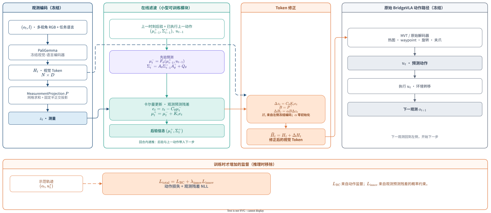

# BridgeVLA 滤波器式 Token Correction

> 状态：当前滤波器路线已经接入代码，标定后的数值 smoke 已通过，正式的 2000-update 训练和多组五次评估也已完成。严格 25 步协议下的正式路线为 87.87%；按 BridgeVLA++ 标准将 `place_cups` 和 `stack_blocks` 放宽到 35 步后，当前最佳完整结果为 88.62%。现阶段仍不能声称滤波器带来了稳定性能提升。

本文是当前方法的主线说明，只描述已经实现的 FilterCorrection 路线、当前实验边界和可复现的实现入口。

### 1.1 当前性能目标

当前研究目标调整为：在与 BridgeVLA++ 相同的 RLBench 评估标准下，将 18-task 平均成功率推进到 **93–94%**。达到这一目标即可视为性能突破；95% 不再是必须完成的硬指标，而是后续可能争取的挑战目标。

这个目标不等于当前结果。当前 h35 协议下最佳完整结果仍为 88.62%，因此后续工作重点应从继续扫描滤波器超参数，转向提升基础动作表示、有限解冻动作路径以及加入低成本时空 Token memory。

## 1. 问题与方法定位

BridgeVLA 的基本路径是：当前多视角观测和任务语言经过冻结的 PaliGemma，得到视觉 Token，再交给原有动作解码器预测下一步动作。

这个逐帧路径的局限是：当前观测可能受到遮挡、视角变化、运动模糊或阶段歧义影响。模型如果只根据当前观测预测动作，就可能在一次观测异常时直接改变动作方向。

本文在不重新训练大视觉主干、不改动原动作解码器的前提下，引入一个参数量很小的、动作条件的递推滤波器：

- 用上一时刻的后验状态和上一动作预测当前隐状态；
- 将当前视觉 Token 投影到测量空间；
- 计算当前观测相对于预测的**观测预测残差**（Kalman 文献中的 innovation）；
- 用显式不确定性决定应吸收多少残差；
- 将被滤波器接受的测量修正量映射回 Token，并以零初始化残差加回原 Token。

方法的核心不是重新学习一个动作头，而是给冻结的 BridgeVLA 增加一个低成本、可递推、可诊断的 Token 修正通路。

## 2. 方法总览

下图是当前实现的唯一主数据流图。蓝色部分是冻结的观测编码，绿色部分是在线滤波器，橙色部分是 Token 修正，灰色部分是保持不变的原始 BridgeVLA 动作路径。

[打开可编辑的 draw.io 源文件](bridgevla_filter_token_correction_dataflow.drawio)

图中最重要的闭环是：

当前观测 $\rightarrow$ 当前测量 $z_t$；上一后验和上一动作 $\rightarrow$ 当前先验；当前测量与先验预测的差异 $\rightarrow$ 滤波更新；滤波更新 $\rightarrow$ Token 残差；修正后的 Token $\rightarrow$ 原始动作路径。

## 3. 数学定义

### 3.1 当前观测与测量

冻结的视觉-语言编码器首先生成当前视觉 Token：

$H_t=\operatorname{PaliGemma}(o_t,l)$。

其中 $o_t$ 是多视角 RGB 观测，$l$ 是任务语言，$H_t\in\mathbb R^{N\times D}$ 是视觉 Token。

直接在完整 Token 空间中做滤波代价较高，因此使用冻结的测量投影 $P$ 保留空间网格并降低维度：

$z_t=P(H_t)\in\mathbb R^m$。

当前实现中的 $P$ 包含逐格求和和固定的半正交投影，不包含可训练参数。它的作用只是定义测量空间，不学习“应该观察哪些 Token”。

### 3.2 动作条件的隐状态

滤波器维护一个回合内递推的 belief：

$(\mu_t,\Sigma_t)$。

$\mu_t\in\mathbb R^d$ 是隐状态均值，$\Sigma_t$ 是对应的不确定性。$\mu_t$ 不是动作、不是视觉 Token，也不被解释为某个可直接观测的物理量；它是一个为当前动作决策服务的紧凑历史记忆。

在当前正式路线中，配置使用 $d=64$。不同配置可以改变 $d$，因此不应把 $\mu_t$ 解释成固定语义的 64 个物理变量。

### 3.3 预测步

上一时刻的后验状态和上一动作共同决定当前先验：

$\mu_t^-=F_\phi(\mu_{t-1}^+,u_{t-1})$。

协方差沿动作条件的转移模型传播：

$\Sigma_t^-=A_\theta\Sigma_{t-1}^+A_\theta^\top+Q_\theta$。

训练时，$u_{t-1}$ 是序列中的前一步动作；推理时，它来自上一决策步的动作。这里的动作输入是滤波器的条件变量，不等同于单独估计的真实世界状态。

### 3.4 观测预测残差与滤波更新

先用先验状态预测当前测量：

$\hat z_t=C_\theta\mu_t^-$。

当前测量与预测测量之间的差异定义为观测预测残差：

$e_t=z_t-\hat z_t=z_t-C_\theta\mu_t^-$。

它不是与人工真值比较得到的误差，而是“当前观测中没有被历史和上一动作解释的部分”。

残差的可信程度由先验不确定性和测量噪声共同决定：

$S_t=C_\theta\Sigma_t^-C_\theta^\top+R_\theta$。

对应的滤波增益为：

$K_t=\Sigma_t^-C_\theta^\top S_t^{-1}$。

后验均值和协方差为：

$\mu_t^+=\mu_t^-+K_te_t$。

$\Sigma_t^+=(I-K_tC_\theta)\Sigma_t^-$。

因此，$e_t$ 负责提供当前观测偏离预测的方向，$K_t$ 负责决定这部分偏离应被吸收多少。若先验不确定性较大或测量噪声较小，滤波器会更重视当前观测；反之则更多保留历史预测。

### 3.5 从测量修正回到视觉 Token

隐状态更新在测量空间中的变化是：

$\Delta z_t=C_\theta(\mu_t^+-\mu_t^-)=C_\theta K_te_t$。

然后使用冻结测量投影的精确伴随 $B=P^\top$ 回到 Token 空间：

$\Delta H_t=B\Delta z_t$。

最终只对原始 Token 添加一个零初始化的残差：

$\widetilde H_t=H_t+\alpha\Delta H_t$。

其中 $\alpha$ 初始为零，因此训练开始时 $\widetilde H_t$ 与 $H_t$ 严格一致；训练后它可以学习一个小的修正幅度。修正后的 Token 继续进入原始 BridgeVLA 路径：

$u_t=\pi_{\mathrm{BridgeVLA}}(\widetilde H_t)$。

原始的 heatmap、waypoint、rotation、gripper 等动作模块不被替换。

## 4. 为什么这是滤波式修正

本文没有直接学习任意函数 $f(H_t,\mu_t)$ 来修改 Token，而是将修正结构限制为：

$\Delta H_t=\alpha P^\top C_\theta K_t e_t$。

这带来三个约束：

1. **方向有来源**：修正方向来自当前观测相对于历史预测的观测预测残差；
2. **幅度有依据**：修正幅度由协方差、测量噪声和卡尔曼增益共同决定；
3. **位置有结构**：$z_t$ 保留空间网格，$P^\top$ 将不同网格位置的修正回投到对应 Token。

因此，模型不会对每一帧都施加同一个任务偏置，而是根据当前观测是否偏离动作条件预测来决定是否修正。

## 5. 回合内数据流

每个回合开始时初始化 $(\mu_0^+,\Sigma_0^+)$。之后每个决策步依次执行：

1. 编码当前观测得到 $H_t$，并计算测量 $z_t=P(H_t)$；
2. 读取上一后验和上一动作，得到 $(\mu_t^-,\Sigma_t^-)$；
3. 计算 $\hat z_t$、$e_t$、$K_t$ 和当前后验；
4. 计算 $\Delta H_t$，得到 $\widetilde H_t$；
5. 将 $\widetilde H_t$ 交给原始 BridgeVLA，得到动作 $u_t$；
6. 将 $(\mu_t^+,\Sigma_t^+)$ 和 $u_t$ 带入下一步。

状态在回合内持续递推，但推理时不需要逐步喂入真值，也不需要候选动作推演或视频生成。

当 stage_two=True 时，同一决策中的第二次 view-space 精修复用第一次得到的后验：每个决策步只推进一次 belief，但两次视觉处理都可以根据该 belief 产生自己的 Token 修正，不提交第二个后验。

## 6. 训练与推理

训练和推理共用同一条前向路径。区别只有训练阶段额外计算监督损失。

### 6.1 训练损失

当前实现的总损失为：

$L_{\mathrm{total}}=L_{\mathrm{BC}}+\lambda_{\mathrm{innov}}L_{\mathrm{innov}}$。

$L_{\mathrm{BC}}$ 是原 BridgeVLA 的动作监督，覆盖当前配置启用的平移、旋转、夹爪和碰撞相关动作项。

观测预测残差的负对数似然为：

$L_{\mathrm{innov}}=\frac{1}{2}\left(e_t^\top S_t^{-1}e_t+\log\det S_t\right)$。

它训练的是滤波器的测量矩阵、状态转移和噪声模型，而不是一个任意的视觉重建器。只最小化残差平方会鼓励模型把测量噪声推大、从而“不做预测”；$\log\det S_t$ 项用于约束这种退化。

当前代码没有独立的 $\lambda_{\mathrm{res}}\|\Delta H_t\|^2$ 项，方法文档不再把它写入总损失。

配置默认 hidden_state_filter_innovation_loss_weight=0.0；正式滤波路线使用 $\lambda_{\mathrm{innov}}=0.05$。因此应明确区分“代码支持的可选损失”和“正式实验实际启用的配置”。

### 6.2 冻结与可训练部分

| 部分 | 作用 | 当前状态 |
|---|---|---|
| PaliGemma | 生成视觉-语言 Token | 冻结 |
| 原始 BridgeVLA 动作路径 | 将 Token 解码成动作 | 冻结 |
| $P$ 与 $B=P^\top$ | 测量与回投 | 冻结 |
| $F_\phi$ | 动作条件的均值转移 | 训练 |
| $C_\theta$ | 隐状态到测量空间的映射 | 训练 |
| $A_\theta$ | 协方差转移 | 训练 |
| $Q_\theta$、$R_\theta$ | 过程噪声和测量噪声 | 训练 |
| $\alpha$ | Token 残差的全局注入幅度 | 训练，零初始化 |

当前正式配置的滤波路径约为 20 万个可训练参数，远小于重新训练 PaliGemma 或重建整套动作头的代价。

## 7. 数值实现与配置

测量空间协方差 $S_t$ 的维度是 $m\times m$，不能显式构造或求逆。当前实现使用信息形式和 Woodbury 恒等式，将主要计算降到隐状态维度 $d$：

$S_t^{-1}=R_\theta^{-1}-R_\theta^{-1}C_\theta(\Sigma_t^{-1}+C_\theta^\top R_\theta^{-1}C_\theta)^{-1}C_\theta^\top R_\theta^{-1}$。

当前正式滤波路线的关键配置为：

| 配置 | 值 | 说明 |
|---|---:|---|
| hidden_state_filter_correction | True | 启用滤波器式 Token 修正 |
| hidden_state_dim | 64 | 隐状态维度 $d$ |
| hidden_state_filter_grid | 4 | 每视角空间网格划分 |
| hidden_state_filter_measure_dim | 64 | 每格测量维度 |
| hidden_state_filter_full_covariance | True | 使用满协方差 |
| hidden_state_filter_init_log_measure_noise | 48.0 | 防止首步后验协方差塌缩 |
| hidden_state_filter_innovation_loss_weight | 0.05 | 正式训练使用的观测残差似然权重 |

$P$ 的尺度和测量噪声初始化非常关键。早期版本曾出现 Token 修正只有 $10^{-6}$ 量级、后验协方差首步塌缩的问题；列正交半正交投影、逐格求和和 $R\approx48$ 的标定已经修复了这两个数值问题。

## 8. 与相近方向的边界

### 8.1 与 LoRA、Adapter 的区别

LoRA 或 Adapter 通常学习一个无状态的特征变换；本文的修正依赖上一状态、上一动作、当前观测预测残差和显式不确定性。两者的差别不是参数量，而是是否能表达“只有当当前观测偏离动作条件预测时才进行修正”。

### 8.2 与 JEPA / JEPA-VLA 的区别

本文不训练 PaliGemma 表示，不生成未来视频，也不使用未来表征预测来塑造视觉编码器。时间信息被放在推理时持续递推的 belief 中，而不是重新预训练一个具有时间预测性的视觉表示。

共同点仅是都可以在表征空间中处理预测关系；本文的核心贡献边界应放在“冻结 VLA Token 空间中的动作条件滤波式修正”，而不是“学习式滤波器”本身。

### 8.3 与 WAM 或完整世界模型的区别

本文不声称学习了环境真实状态，不生成未来观测，不进行候选动作规划，也不构成完整的世界模型。$\mu_t$ 是服务于当前动作修正的任务相关隐状态，不能直接解释为真实物理状态。

## 9. 当前证据与结论边界

### 9.1 已验证的工程和数值事实

- FilterCorrection 的 CPU 单元测试通过：覆盖投影伴随、协方差更新、观测预测残差、负对数似然、零初始化、梯度可达性和输入校验；
- 真实维度的前向和 400-update 标定 smoke 通过，无 NaN、OOM 或首步协方差塌缩；
- 标定后真实前向的 residual ratio 为 $3.162425\times10^{-3}$，posterior trace 为 $19.57753$，说明修正通路已经达到可观测量级；
- 正式配置完成 2000-update 训练和五次独立评估。

这些结果证明当前实现可以稳定运行，不能单独证明方法已经提升任务成功率。

### 9.2 正式评估结果

评估协议为 18 个 RLBench 任务、每任务 25 个 episode、五次独立运行，共 2250 个 episode。严格 25 步协议和按 BridgeVLA++ 标准设置的 h35 协议需要分开报告。

| 配置 | 18-task 平均 |
|---|---:|
| 原始 BridgeVLA，本地复测，25 步 | 87.38% |
| 当前滤波路线，`lambda=0.05`，25 步 | 87.87% |
| 当前滤波路线，`lambda=0.05`，h35 | 88.04% |
| 当前滤波路线，`lambda=0`，h35 | **88.62%** |
| 阶段目标 | **93–94%** |

逐任务汇总见：[25 步正式滤波结果](../outputs/filter_route_formal_2000_20260915/eval_five_repeats_final/aggregate.txt)、[h35 `lambda=0.05` 结果](../outputs/filter_route_lambda005_seed2027_formal_2000_20260920_retry1/eval_launcher_h35/aggregate.txt)和 [h35 `lambda=0` 结果](../outputs/filter_route_lambda0_seed2027_formal_2000_20260920/eval_launcher_h35/aggregate.txt)。

在当前最佳 h35 结果中，较弱任务仍包括 `place_cups`（64.80%）、`place_shape_in_shape_sorter`（61.60%）、`put_groceries_in_cupboard`（72.00%）、`stack_blocks`（81.60%）和 `stack_cups`（80.00%）。因此目前更稳妥的结论是：滤波路线已经达到基线级别，但距离 93–94% 目标仍需要改变动作表示和可训练路径；性能增益和“修正集中在高歧义帧”的机制主张仍未被证明。

### 9.3 可以与不可以声称的内容

可以声称：

- 一个参数高效的冻结 VLA Token 修正框架；
- Token 修正被写成测量空间中的贝叶斯滤波更新；
- 滤波器使用动作条件的回合内隐状态和显式不确定性；
- 原始 BridgeVLA 动作解码路径保持不变；
- 当前实现已经通过数值健康检查并完成了正式评估。

暂时不应声称：

- 相对于原始 BridgeVLA 已经有稳定成功率提升；
- 已经达到 93–94% 的阶段目标；
- $\mu_t$ 学到了环境真实状态或可规划的世界模型；
- 方法等同于完整 WAM、标准 JEPA 或 JEPA-VLA；
- 修正一定集中在高歧义、高不确定性帧；
- 性能差异已经可以归因于观测预测残差、卡尔曼增益或不确定性建模中的某一个因素。

## 10. 下一步实验

为了把“可运行的方法”推进到 93–94% 的阶段目标，并同时保留低成本方法主线，优先级如下：

1. 使用完全匹配的原始 BridgeVLA checkpoint、训练预算、数据和五次评估协议完成 h35 baseline，消除当前协议和基线差异；
2. 将离散 Euler rotation 替换为连续 6D rotation，并重新训练原始 action head 与 convex upsampling；
3. 在保留滤波器的同时加入小型 temporal/spatial Token memory，只解冻 memory adapter、upsampling 和 action head，必要时再对最后少量 backbone 层使用 LoRA；
4. 将状态转移从“模型预测动作”扩展为“实际执行后的 EEF/控制反馈”，同时检查训练专家动作与推理预测动作之间的 rollout mismatch；
5. 针对 `place_cups`、`place_shape_in_shape_sorter`、`put_groceries_in_cupboard`、`stack_blocks` 和 `stack_cups` 做逐任务、逐步长和逐回合诊断；
6. 最后再做 $\lambda_{\mathrm{innov}}=0$、滤波器噪声、stage-two 后验复用和 Token correction norm 的机制对照。

在这些对照完成前，方法文档应把当前结果定位为“数值健康、基线级性能、距离 93–94% 目标仍有明显差距、机制证据待补”，而不是性能提升结论。

## 11. 实现入口

当前实现集中在以下文件：

| 文件 | 作用 |
|---|---|
| finetune/bridgevla/hidden_state/filter_correction.py | 测量投影、滤波更新、观测残差似然和 Token 修正 |
| finetune/bridgevla/mvt/mvt_single.py | 单次视觉处理中的滤波调用和 Token 注入 |
| finetune/bridgevla/mvt/mvt.py | stage-two 的后验复用约定 |
| finetune/bridgevla/models/bridgevla_agent.py | 动作损失、观测残差似然和序列状态传递 |
| finetune/RLBench/train.py | 训练入口和配置校验 |

核心配置示例：

    python -m train \
      --hidden_state_route_only \
      --init_checkpoint <model_80.pth> \
      --mvt_cfg_opts "hidden_state_enabled True hidden_state_filter_correction True hidden_state_filter_init_log_measure_noise 48.0 hidden_state_dim 64" \
      --exp_cfg_opts "rvt.hidden_state_filter_innovation_loss_weight 0.05"

图和文档都只描述当前这条 filter-only 路线，后续实验记录应写入独立的结果报告或输出目录。
