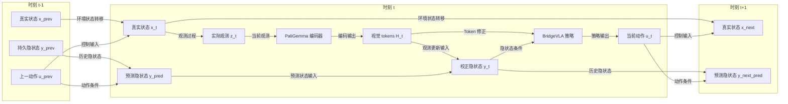

# BridgeVLA 的概率机器人建模

BridgeVLA 将 RLBench 的环境观测编码为 tokens 和 hidden state，并据此产生动作。本文采用《概率机器人》的状态空间模型：$x_t$ 是真实状态，$z_t$ 是观测，$y_t$ 是对状态或 belief 的可学习表示。

## 1. 状态、观测与 belief

| 符号 | 含义 |
|---|---|
| $x_t$ | RLBench simulator 在时刻 $t$ 的真实状态，策略不可直接访问 |
| $z_t$ | RLBench 返回的 RGB、深度、点云和 proprioception 等观测 |
| $u_t$ | 从时刻 $t$ 执行到 $t+1$ 的 waypoint action 或 action chunk |
| $l$ | 语言任务目标 |
| $H_t$ | $\mathrm{PaliGemma}(z_t,l)$ 产生的 tokens |
| $y_t^-$ | 当前观测到达前的预测 hidden state |
| $y_t$ | 吸收当前观测后的 hidden state |
| $F_\phi$ | 动作条件下的状态转移预测 |
| $U_\omega$ | 观测更新，用 PaliGemma tokens $H_t$ 校正预测状态 |
| $p_\eta(z\mid y)$ | observation decoder |
| $A_\psi$ | 用 hidden state 修正当前 tokens |
| $\pi_\theta$ | waypoint policy |

概率机器人模型由状态转移和观测过程组成：

$$
 x_1\sim p_0(x_1),
 \qquad
 x_{t+1}\sim p_{\mathrm{env}}(x_{t+1}\mid x_t,u_t),
 \qquad
 z_t\sim p_{\mathrm{env}}(z_t\mid x_t).
$$

对应的轨迹联合分布为：

$$
 p(x_{1:T},z_{1:T}\mid u_{1:T-1})
 =p_0(x_1)
 \prod_{t=1}^{T-1}p_{\mathrm{env}}(x_{t+1}\mid x_t,u_t)
 \prod_{t=1}^{T}p_{\mathrm{env}}(z_t\mid x_t).
$$

其中 $p_{\mathrm{env}}(z_t\mid x_t)$ 是 RLBench 的观测模型。概率形式不表示一定显式加入传感器噪声；即使渲染近似确定，遮挡和有限视角仍会造成部分可观测性。

Bayes filter 的 belief 为：

$$
 b_t(x_t)=p(x_t\mid z_{1:t},u_{1:t-1}).
$$

它先进行动作预测：

$$
 \bar b_t(x_t)
 =\int p_{\mathrm{env}}(x_t\mid x_{t-1},u_{t-1})
 b_{t-1}(x_{t-1})\,\mathrm{d}x_{t-1},
$$

再使用当前观测更新：

$$
 b_t(x_t)=\eta\,p_{\mathrm{env}}(z_t\mid x_t)\bar b_t(x_t).
$$

## 2. BridgeVLA 的 hidden-state 表示

完整的 hidden-state filter 对应：

$$
 H_t=\mathrm{PaliGemma}(z_t,l),
 \qquad
 y_t^-=F_\phi(y_{t-1},u_{t-1}),
 \qquad
 y_t=U_\omega(y_t^-,H_t).
$$

其中 $y_t^-$ 表示预测 belief，$y_t$ 表示吸收当前观测表示后的 belief。$U_\omega$ 内部如何处理 token 不在本文固定，可以使用 pooling、projection、cross-attention 或 gated update。策略使用当前 tokens 和 hidden state：

$$
 \widetilde H_t=H_t+A_\psi(H_t,y_t),
$$

$$
 u_t\sim\pi_\theta(u\mid\widetilde H_t,y_t,l).
$$

如果训练时可以访问 simulator state，可以增加：

$$
 \mathcal L_x
 =\left\|P_y(y_t)-P_x(x_t)\right\|^2.
$$

否则，$y_t$ 更准确地被定义为 belief 或 predictive state representation，而不保证与完整 $x_t$ 在坐标上相同。

## 3. 时间展开的数据流：状态、观测、隐状态与动作

下面将 $t-1$、$t$ 和 $t+1$ 展开为数据节点。$x$ 由环境维护，$z$ 是每个时刻新产生的观测，$y$ 是模型维护的隐状态，$u$ 是连接策略和环境的动作反馈。

图中明确区分了两条路径：实际观测 $z_t$ 先经 PaliGemma 形成 $H_t$，再由 $H_t$ 同时参与 token 修正和 hidden-state update；策略融合修正后的 tokens 与 $y_t$ 后输出 $u_t$。其中 $F_\phi$、$U_\omega$ 和 $A_\psi$ 是箭头上的运算，$x_t$、$z_t$、$H_t$、$y_t$ 和 $u_t$ 是随时间展开的数据节点。本文不规定 $U_\omega$ 对 $H_t$ 的具体降维或注意力方式。observation decoder 仅用于训练辅助，不放入主控制路径。

观测 decoder 近似预测 belief 经过环境观测模型后的分布：

$$
 p_\eta(z_{t+1}\mid y_{t+1}^-)
 \approx
 \int p_{\mathrm{env}}(z_{t+1}\mid x_{t+1})
 q(x_{t+1}\mid y_{t+1}^-)\,\mathrm{d}x_{t+1}.
$$

## 4. 训练目标

按 episode 顺序展开 $y$：

$$
 H_t=\mathrm{PaliGemma}(z_t,l),
 \qquad
 y_1=U_\omega(y_{\mathrm{init}},H_1),
$$

$$
 y_{t+1}^-=F_\phi(y_t,u_t),
 \qquad
 y_{t+1}=U_\omega(y_{t+1}^-,H_{t+1}).
$$

行为克隆和观测预测损失为：

$$
 \mathcal L_{\mathrm{BC}}
 =-\sum_t\log\pi_\theta(u_t^*\mid\widetilde H_t,y_t,l),
$$

$$
 \mathcal L_{\mathrm{obs}}
 =-\sum_t\log p_\eta(z_{t+1}\mid y_{t+1}^-).
$$

组合目标为：

$$
 \mathcal L
 =\mathcal L_{\mathrm{BC}}
 +\lambda_{\mathrm{obs}}\mathcal L_{\mathrm{obs}}
 +\lambda_x\mathcal L_x.
$$

因此，$F_\phi$ 的训练需要跨多个连续 decision 展开；独立 transition replay 不能验证完整的 sequence-training 梯度。

## 5. 当前实现边界

当前代码实现的是轻量路由：

$$
 z_t\xrightarrow{\mathrm{PaliGemma}}H_t
 \xrightarrow{A_\psi(\cdot,y_t)}\widetilde H_t,
 \qquad
 y_{t+1}=F_\phi(y_t,u_t).
$$

因此，当前动作仍然可以通过 PaliGemma 看到最新观测 $z_t$；但 $z_t$ 尚未通过 $U_\omega$ 写回未来的 hidden state。这正是轻量实现与完整 predict–observe–correct 模型之间的差距，而不是环境观测模型本身的断裂。

当前尚未实现：

- 使用当前 RLBench 观测更新 $y_t$ 的 $U_\omega$；
- observation decoder $p_\eta(z\mid y)$；
- 基于真实 simulator state 的 $\mathcal L_x$；
- 完整的 episode-level sequence training。

关闭 `hidden_state_enabled` 时仍保持原始 BridgeVLA checkpoint 的严格加载兼容性。历史 token-window、cache 和 temporal-loss 路径不属于当前接口。
