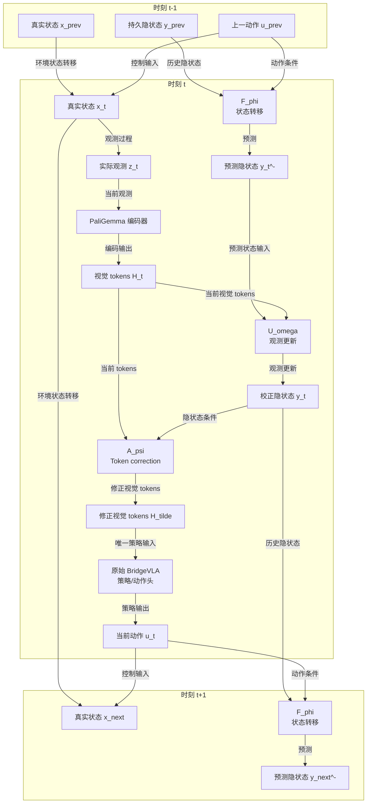

# BridgeVLA 的概率机器人建模

BridgeVLA 将 RLBench 的环境观测编码为 tokens 和 hidden state，并据此产生动作。本文采用《概率机器人》的状态空间模型：$x_t$ 是真实状态，$z_t$ 是观测，$y_t$ 是对状态或 belief 的可学习表示。当前 H-token 扩展采用严格的 token-only 路线：hidden state 只通过 token correction 进入原有 BridgeVLA 动作解码，不作为动作策略的额外直连输入。

## 1. 状态、观测与 belief

| 符号 | 含义 |
|---|---|
| $x_t$ | RLBench simulator 在时刻 $t$ 的真实状态，策略不可直接访问 |
| $z_t$ | RLBench 返回的 RGB、深度、点云和 proprioception 等观测 |
| $u_t$ | 从时刻 $t$ 执行到 $t+1$ 的 waypoint action 或 action chunk |
| $l$ | 语言任务目标 |
| $H_t$ | $\mathrm{PaliGemma}(z_t,l)$ 产生的 tokens |
| $y_t^-$ | 当前观测到达前的预测 hidden state |
| $y_t$ | 吸收当前观测后的 hidden state |
| $F_\phi$ | 动作条件下的状态转移预测 |
| $U_\omega$ | 观测更新，用 PaliGemma tokens $H_t$ 校正预测状态 |
| $p_\eta(z\mid y)$ | observation decoder |
| $A_\psi$ | 用 hidden state 修正当前 visual tokens |
| $\widetilde H_t$ | 经过 $A_\psi$ 修正、供原始策略使用的 visual tokens |
| $\pi_\theta$ | 只接收 $\widetilde H_t$ 的 waypoint policy |

概率机器人模型由状态转移和观测过程组成：

$$
 x_1\sim p_0(x_1),
 \qquad
 x_{t+1}\sim p_{\mathrm{env}}(x_{t+1}\mid x_t,u_t),
 \qquad
 z_t\sim p_{\mathrm{env}}(z_t\mid x_t).
$$

对应的轨迹联合分布为：

$$
 p(x_{1:T},z_{1:T}\mid u_{1:T-1})
 =p_0(x_1)
 \prod_{t=1}^{T-1}p_{\mathrm{env}}(x_{t+1}\mid x_t,u_t)
 \prod_{t=1}^{T}p_{\mathrm{env}}(z_t\mid x_t).
$$

其中 $p_{\mathrm{env}}(z_t\mid x_t)$ 是 RLBench 的观测模型。概率形式不表示一定显式加入传感器噪声；即使渲染近似确定，遮挡和有限视角仍会造成部分可观测性。

Bayes filter 的 belief 为：

$$
 b_t(x_t)=p(x_t\mid z_{1:t},u_{1:t-1}).
$$

它先进行动作预测：

$$
 \bar b_t(x_t)
 =\int p_{\mathrm{env}}(x_t\mid x_{t-1},u_{t-1})
 b_{t-1}(x_{t-1})\,\mathrm{d}x_{t-1},
$$

再使用当前观测更新：

$$
 b_t(x_t)=\eta\,p_{\mathrm{env}}(z_t\mid x_t)\bar b_t(x_t).
$$

## 2. BridgeVLA 的 hidden-state 表示

完整的 hidden-state filter 对应：

$$
 H_t=\mathrm{PaliGemma}(z_t,l),
 \qquad
 y_t^-=F_\phi(y_{t-1},u_{t-1}),
 \qquad
 y_t=U_\omega(y_t^-,H_t).
$$

其中 $y_t^-$ 表示预测 belief，$y_t$ 表示吸收当前观测表示后的 belief。$U_\omega$ 内部如何处理 token 不在本文固定，可以使用 pooling、projection、cross-attention 或 gated update。严格 token-only 路线中，策略只接收经过 correction 的 visual tokens；$y_t$ 仅作为 $A_\psi$ 的条件输入：

$$
 \widetilde H_t=H_t+A_\psi(H_t,y_t),
$$

$$
 u_t\sim\pi_\theta(u\mid\widetilde H_t).
$$

语言条件 $l$ 已包含在 $H_t=\mathrm{PaliGemma}(z_t,l)$ 中，不再作为 hidden state 到策略的额外直连路径。

如果训练时可以访问 simulator state，可以增加：

$$
 \mathcal L_x
 =\left\|P_y(y_t)-P_x(x_t)\right\|^2.
$$

否则，$y_t$ 更准确地被定义为 belief 或 predictive state representation，而不保证与完整 $x_t$ 在坐标上相同。

## 3. 时间展开的数据流：状态、观测、隐状态与动作

下面将 $t-1$、$t$ 和 $t+1$ 展开为数据节点。$x$ 由环境维护，$z$ 是每个时刻新产生的观测，$y$ 是模型维护的隐状态，$u$ 是连接策略和环境的动作反馈。

图中明确展示了 token-only 的三段式路径：实际观测 $z_t$ 先经 PaliGemma 形成 $H_t$；$F_\phi$ 根据历史隐状态和上一动作产生 $y_t^-$，$U_\omega$ 再用当前 $H_t$ 完成观测更新得到 $y_t$；最后 $A_\psi(H_t,y_t)$ 产生修正视觉 tokens $\widetilde H_t$。原始 BridgeVLA 策略和动作头只接收 $\widetilde H_t$ 并输出 $u_t$，不存在 $y_t$ 到策略、action features 或 translation heatmap 的额外直连。$F_\phi$、$U_\omega$ 和 $A_\psi$ 是图中的新增运算，$x_t$、$z_t$、$H_t$、$y_t$、$\widetilde H_t$ 和 $u_t$ 是随时间展开的数据节点。本文不规定 $U_\omega$ 对 $H_t$ 的具体降维或注意力方式。observation decoder 仅用于训练辅助，不放入主控制路径。

观测 decoder 近似预测 belief 经过环境观测模型后的分布：

$$
 p_\eta(z_{t+1}\mid y_{t+1}^-)
 \approx
 \int p_{\mathrm{env}}(z_{t+1}\mid x_{t+1})
 q(x_{t+1}\mid y_{t+1}^-)\,\mathrm{d}x_{t+1}.
$$

## 4. 训练目标

按 episode 顺序展开 $y$：

$$
 H_t=\mathrm{PaliGemma}(z_t,l),
 \qquad
 y_1=U_\omega(y_{\mathrm{init}},H_1),
$$

$$
 y_{t+1}^-=F_\phi(y_t,u_t),
 \qquad
 y_{t+1}=U_\omega(y_{t+1}^-,H_{t+1}).
$$

行为克隆和观测预测损失为：

$$
 \mathcal L_{\mathrm{BC}}
 =-\sum_t\log\pi_\theta(u_t^*\mid\widetilde H_t),
$$

$$
 \mathcal L_{\mathrm{obs}}
 =-\sum_t\log p_\eta(z_{t+1}\mid y_{t+1}^-).
$$

组合目标为：

$$
 \mathcal L
 =\mathcal L_{\mathrm{BC}}
 +\lambda_{\mathrm{obs}}\mathcal L_{\mathrm{obs}}
 +\lambda_x\mathcal L_x.
$$

因此，$F_\phi$ 的训练需要跨多个连续 decision 展开；独立 transition replay 不能验证完整的 sequence-training 梯度。

## 5. 当前实现与边界

当前 hidden-state 路由已经按完整的 predict–observe–correct 顺序接入：

$$
 H_t=\mathrm{PaliGemma}(z_t,l),
 \qquad
 y_t^-=F_\phi(y_{t-1},u_{t-1}),
 \qquad
 y_t=U_\omega(y_t^-,H_t),
$$

$$
 \widetilde H_t=H_t+A_\psi(H_t,y_t),
 \qquad
 u_t=\pi_\theta(\widetilde H_t).
$$

代码中的 `U_omega` 使用一个由 $y_t^-$ 产生的 query 对当前 PaliGemma visual tokens 做 cross-attention，再由 `GRUCell` 完成 observation update；token 的处理封装在 `U_omega` 内，而不是把 RGB 直接传入 update。随后 `A_psi` 仅根据 $H_t$ 和 $y_t$ 生成 token correction，原始 BridgeVLA action decoder 只接收 $\widetilde H_t$，因此没有 hidden state 到动作头或 translation heatmap 的额外直连。RLBench 的 sequence sampler 现在从 replay 的 episode 起点按 forward action 顺序读取完整 episode，并将不同长度的 episode padding 到 batch 最大长度；terminal/timeout transition 本身有效，`terminal=-1` 的 `add_final` observation 不进入 sequence。每个 episode 只在起点初始化一次 hidden state，padding 由 `valid_mask`/`loss_mask` 排除。`RVTAgent.update_sequence()` 默认采用 one-step truncated BPTT：先 detach 当前 posterior，再在 grad-enabled 环境中计算 `F_\phi`，保持 hidden state 数值连续，同时让下一步 action loss 训练 `F_\phi`，而不把更晚时间步的梯度传回更早状态。

sequence update 会冻结 `BatchNorm` 运行统计，并关闭 DDP 对模块 buffer 的逐步广播，以避免累积多个时间步的反向图时发生 buffer 版本变化。

当前仍未实现：

- observation decoder $p_\eta(z\mid y)$；
- 基于真实 simulator state 的 $\mathcal L_x$；
- 跨 batch 的 episode state carry（当前每个 batch row 都是一个完整 episode，并在 episode 起点重新使用零 prior；不会把不同 episode 的 hidden state 串接）。

`hidden_state_enabled=False` 时不注册新增路由模块，原始 BridgeVLA 的 checkpoint keys 与默认 forward path 保持兼容。新路由使用 `hidden_state_sequence_training=True` 开启；RLBench 默认读取完整 episode，并用 `hidden_state_sequence_bptt_length=1` 截断梯度。`hidden_state_sequence_length` 与 `hidden_state_sequence_burn_in` 仅保留给 legacy fixed-window sampler。
