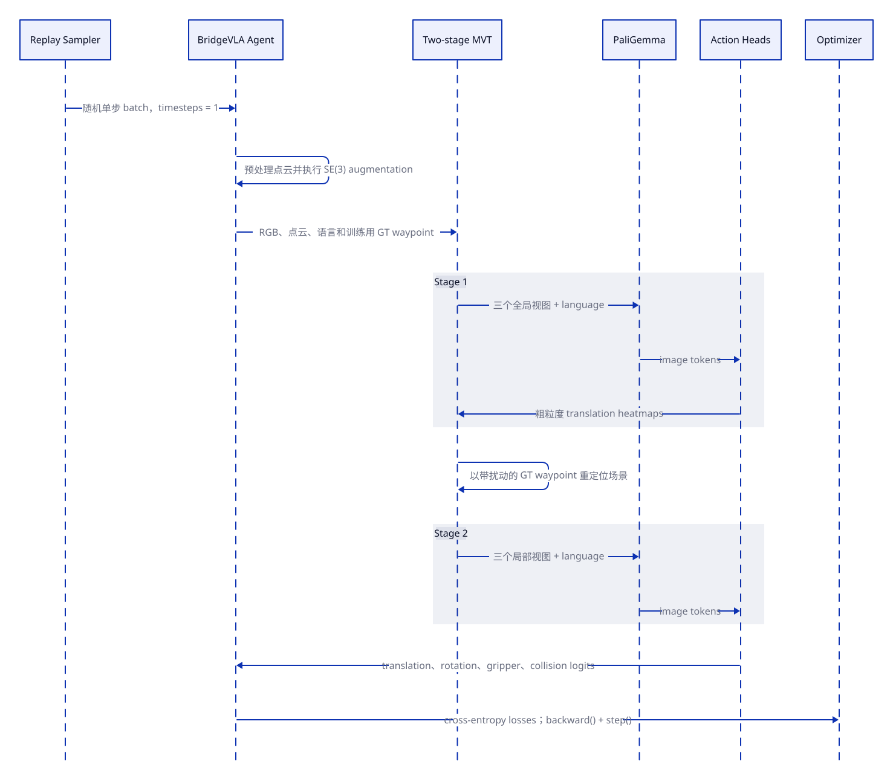
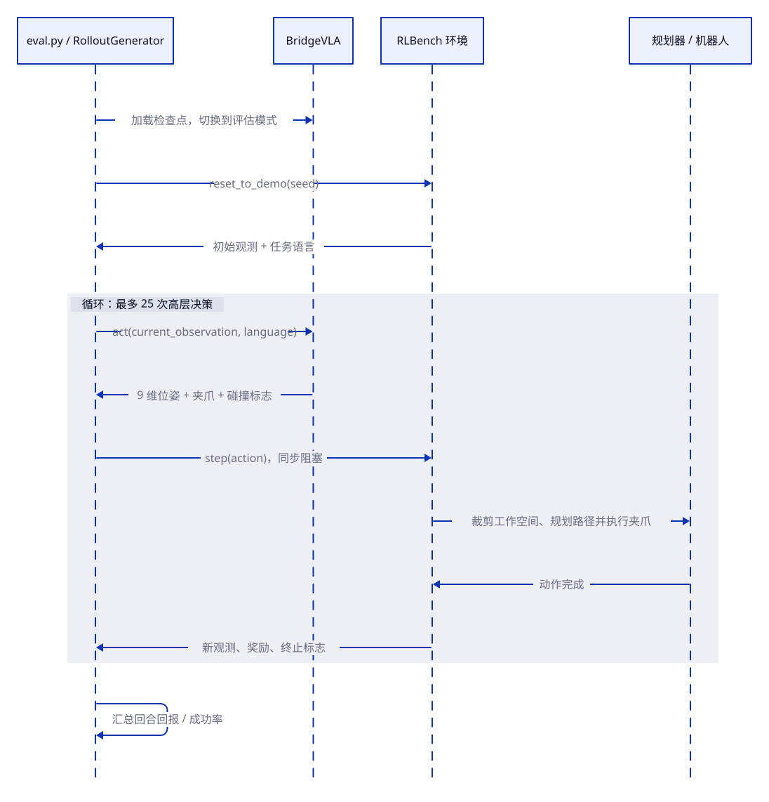

# BridgeVLA 训练与推理验证流程（RLBench）

本文只描述当前仓库中的两条主线：离线监督训练，以及加载模型后的在线推理验证。BridgeVLA 的基本映射是：

> 当前多视角观测 + 任务语言 → 下一个关键点动作

图使用 D2 编写；`.d2` 源文件和供 VS Code Markdown 预览显示的 `.svg` 均位于 [`docs/diagrams/`](diagrams/)。

## 1. 监督训练

RLBench 专家演示会先被处理成回放样本。每张回放样本都是一条独立监督数据：

| 内容 | 数据 |
| --- | --- |
| 输入 | 当前时刻四相机 RGB、点云和任务语言 |
| 标签 | 下一个关键点的三维位置、四元数、夹爪开合和忽略碰撞标志 |

训练时从回放数据中随机抽取 `timesteps = 1` 的批次，因此网络不会看到观测历史、未来图像或关键点时间戳。

图源：[`training_sequence.d2`](diagrams/training_sequence.d2)

训练中的关键步骤：

1. 融合四相机点云，裁剪并归一化到场景空间。
2. MVT 将点云正交渲染成三个视图，PaliGemma 联合处理图像和语言。
3. 平移预测头生成多视角热图；其他预测头生成旋转、夹爪和碰撞状态。
4. 默认的两阶段 MVT 在训练阶段 2 时使用带扰动的真实路点；这是教师强制。
5. 默认配置下，将各动作分量的交叉熵等权相加并更新模型：

$$
\begin{aligned}
\mathcal{L}_{\mathrm{action}} ={}&
\mathcal{L}_{\mathrm{trans}}
+ \mathcal{L}_{\mathrm{rot},x}
+ \mathcal{L}_{\mathrm{rot},y}
+ \mathcal{L}_{\mathrm{rot},z} \\
&+ \mathcal{L}_{\mathrm{grip}}
+ \mathcal{L}_{\mathrm{collision}}.
\end{aligned}
$$

这是离线行为克隆：奖励会保存在回放数据结构中，但不参与该动作损失。

## 2. 推理验证

`eval.py` 加载检查点，创建 BridgeVLA 智能体和 RLBench 环境。默认每个任务评估 25 个回合，每个回合最多执行 25 次高层决策；正常评估不会读取未来专家动作。

模型每次只接收最新观测和固定的任务语言，并输出九维动作：

$$
\mathbf{a}
=
\left[x, y, z, q_x, q_y, q_z, q_w, g, c_{\mathrm{ignore}}\right],
$$

其中 $g$ 表示夹爪开合，$c_{\mathrm{ignore}}$ 对应代码中的 `ignore_collision`。

图源：[`online_rollout_sequence.d2`](diagrams/online_rollout_sequence.d2)

一次在线循环为：

1. `RolloutGenerator` 将当前观测和语言交给 `agent.act()`。
2. `env.step(action)` 使用 `EndEffectorPoseViaPlanning2` 和 `MoveArmThenGripper` 执行目标位姿及夹爪动作。
3. 路径规划和底层仿真同步执行；`env.step()` 返回新观测后才会触发下一次推理。
4. 回合结束后汇总回报；在该任务设置中它被记录为成功率。

因此它是在线闭环的高层路点控制，而不是逐相机帧的实时控制。模型不知道回合总长度，也不知道下一个关键点的时间戳。

## 3. 训练与推理的核心差异

| 项目 | 训练 | 推理验证 |
| --- | --- | --- |
| 数据 | 随机单步回放样本 | 环境返回的最新观测 |
| 阶段 2 中心 | 带扰动的真实路点 | 阶段 1 预测路点 |
| 动作 | 仅计算监督损失 | 由规划器和机器人执行 |
| 下一步触发 | 采样器抽取下一条样本 | 上一个 `env.step()` 完成 |
| 未来信息 | 数据构建阶段可见，网络不可见 | 完全不可见 |

推理时阶段 1 的定位误差会传给阶段 2，执行误差还会改变下一次观测；这是训练与在线运行之间最重要的差异。

## 4. 主要源码入口

- 回放数据构建：[`dataset.py`](../finetune/RLBench/utils/dataset.py)、[`get_dataset.py`](../finetune/RLBench/utils/get_dataset.py)
- 训练入口：[`train.py`](../finetune/RLBench/train.py)、[`bridgevla_agent.py`](../finetune/bridgevla/models/bridgevla_agent.py) 中的 `update()`
- 两阶段 MVT：[`mvt.py`](../finetune/bridgevla/mvt/mvt.py)、[`mvt_single.py`](../finetune/bridgevla/mvt/mvt_single.py)
- 推理验证：[`eval.py`](../finetune/RLBench/eval.py)、[`rollout_generator.py`](../finetune/bridgevla/libs/YARR/yarr/utils/rollout_generator.py)
- 动作执行：[`rlbench_planning.py`](../finetune/RLBench/utils/rlbench_planning.py)、[`action_mode.py`](../finetune/bridgevla/libs/RLBench/rlbench/action_modes/action_mode.py)

## 5. 总结

训练阶段用单时刻回放样本监督“当前观测与语言到下一关键点动作”的映射；验证阶段则反复执行 `观察 → 预测 → 规划执行 → 新观察`，直到任务成功、失败或达到最大决策步数。
