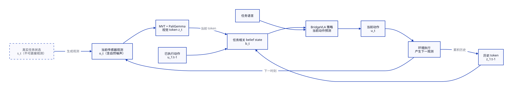

# BridgeVLA 部分可观测任务中的动作条件历史信念状态（方案讨论稿）

> **当前结论：** BridgeVLA 可以被理解为一个部分可观测的机器人控制问题：单个当前观测不一定足以可靠判断任务状态，需要结合历史视觉 tokens 和机器人已经发生的实际运动，维护一个面向任务的 belief state，再决定当前动作。
>
> **当前方案：** 优先设计一个可离线训练、部署时递推的动作条件 belief-state 模块。是否进一步做在线 test-time training，暂时作为后续增强，不作为问题定义的一部分。
>
> 本文已经纳入本地 RLBench 原始数据的审计结果，但不固定具体网络结构、Kalman 形式或最终训练损失。

## 1. 总体目标

希望得到一个能够持续维护任务状态的策略：

```text
当前观测可能不可靠
    -> 结合历史观测和机器人实际运动
    -> 估计当前最可能的任务状态
    -> 输出当前动作
```

目标不是让动作简单变平滑，而是同时满足：

- 当前观测暂时不可靠时，历史信息能够提供补充；
- 机器人真实状态发生变化时，状态估计和动作能够及时变化；
- 不把历史信息机械地当成旧动作，而是维护对当前任务状态的判断；
- 在执行失败、运动偏差或观测异常后，belief 不持续累积错误。

## 2. 概率机器人视角

设：

- `s_t`：时刻 `t` 的真实任务状态，但不可直接获得；
- `o_t`：相机和点云产生的观测，包含自然噪声；
- `z_t = E(o_t)`：MVT/PaliGemma 得到的当前视觉 token；
- `u_t^ach`：时刻 `t` 到 `t+1` 之间实际发生的 EEF 运动；
- `u_t^cmd`：策略发出的目标动作或目标 pose；
- `b_t`：根据历史信息得到的任务相关 belief state。

目标可以抽象为：

$$
b_t = p(s_t \mid o_{1:t}, u^{ach}_{1:t-1}),
\qquad
\hat u^{cmd}_t = \pi(b_t, z_t, \text{language}).
$$

这里的 `belief state` 不一定要实现为显式概率分布，也可以是一个学习得到的紧凑隐状态。它至少应包含对当前动作有用的信息，例如：

- 当前任务阶段；
- 物体与末端执行器的关系；
- 下一关键点相关状态；
- 当前观测的可靠程度；
- 最近的实际运动是否已经造成了真实状态变化。

其递推形式可以先写成 Bayes filter 风格：

$$
\begin{aligned}
 b_t^- &= F_{\mathrm{pred}}(b_{t-1}, u^{ach}_{t-1}, \Delta t),\\
 b_t &= F_{\mathrm{update}}(b_t^-, z_t),\\
 \hat u^{cmd}_t &= \pi(b_t, z_t, \text{language}).
\end{aligned}
$$

`F_pred` 表示根据实际运动进行状态预测，`F_update` 表示根据当前视觉观测进行更新。它们是否采用显式不确定性、Kalman 风格增益或纯神经网络形式，暂不确定。



**读图：** 当前观测经过 PaliGemma 形成 `z_t`；历史 tokens 和已经执行的动作共同参与 belief 更新；belief 再与当前 token、任务语言一起交给 BridgeVLA 策略。执行动作后，环境产生下一观测，形成闭环。图中没有指定某个具体校正模块，也没有指定必须使用人工噪声或在线参数更新。

图源：[`belief_state_problem_overview.d2`](diagrams/belief_state_problem_overview.d2)

## 3. 拟议方案：动作条件的历史 belief 模块

现有 BridgeVLA 可以简化为：

```text
当前多视角观测 + 任务语言
    -> MVT / PaliGemma
    -> 当前视觉 tokens
    -> 原有动作解码路径
    -> 下一关键点动作
```

新的方案在当前视觉 tokens 到动作解码之间增加一个历史状态递推过程：

```text
当前观测
    -> MVT / PaliGemma -> 当前 token z_t

上一时刻 belief b_{t-1}
+ 上一时刻到当前时刻的实际 EEF 运动 u_{t-1}^ach
    -> belief 预测 b_t^-

b_t^- + 当前 token z_t
    -> belief 观测更新 b_t

b_t + 当前 token + 任务语言
    -> 原 BridgeVLA 动作预测路径
```

当前不把它限定为“token correction”。更准确的描述是：

> **用动作条件的历史 belief 表示补充当前观测，再由 BridgeVLA 根据 belief 做动作决策。**

最终 belief 是直接作为动作头输入、调制 Stage-1 token，还是通过残差方式影响原有特征，均为待定。首版也不预设是否冻结 PaliGemma 和动作头。

## 4. 已确认的数据条件

### 4.1 原始数据位置

本地仓库中已经存在 RLBench 原始数据：

```text
data/RLBench_TRAIN_DATA/
data/RLBench_EVAL_DATA/
```

其中：

- `RLBench_TRAIN_DATA`：训练 demonstrations；
- `RLBench_EVAL_DATA`：独立的 held-out evaluation episodes；
- 每个 task 下包含 `all_variations/episodes/episodeN/`；
- 每个 episode 中包含 `low_dim_obs.pkl` 和多视角 RGB、depth、mask 文件。

示例：

```text
data/RLBench_TRAIN_DATA/close_jar/all_variations/episodes/episode0/
├── low_dim_obs.pkl
├── front_rgb/
├── front_depth/
├── left_shoulder_rgb/
├── right_shoulder_rgb/
└── wrist_rgb/
```

### 4.2 原始 observation 中包含逐帧 EEF pose

`low_dim_obs.pkl` 中的每个 RLBench `Observation` 包含：

- `gripper_pose`：位置和四元数；
- `gripper_open`；
- `joint_positions`；
- `gripper_joint_positions`。

因此，可以从原始连续 observation 直接构造实际运动：

```text
q_t = obs[t].gripper_pose
q_{t+1} = obs[t+1].gripper_pose
```

推荐将实际运动表示为：

$$
u^{ach}_t = (\Delta T_t, \Delta g_t, \Delta t),
\qquad
\Delta T_t = T(q_t)^{-1}T(q_{t+1}),
$$

其中 `ΔT_t` 是相对 SE(3) 位姿变化，`Δg_t` 是夹爪状态变化，`Δt` 是时间间隔。不能直接对四元数做普通逐元素相减。

### 4.3 实际运动与目标动作必须区分

数据中存在两种不同含义的 pose：

```text
目标动作 u_t^cmd
    = 策略或 demonstration 指向的目标 EEF pose

实际运动 u_t^ach
    = 连续 observation 中真实记录的 EEF pose 增量
```

对于 belief 的状态预测，优先使用 `u_t^ach`。因为目标动作只说明“希望到哪里”，不能保证机器人实际到达了那里；RLBench 的路径规划可能产生偏差、失败或提前终止。

在线执行时，两者都可能获得：

```text
agent 输出 -> u_t^cmd
env.step 后的前后 observation -> u_t^ach
```

`u_t^cmd` 可以作为额外输入，用于判断命令与实际运动是否存在偏差，但不应替代 `u_t^ach`。

## 5. 为什么不直接复用现有 replay

当前 replay 的主要限制是：

1. `get_dataset.py` 创建 replay 时使用 `timesteps=1`；
2. `extract_obs()` 会把 `gripper_pose`、`joint_positions` 等状态字段从 observation 中移除；
3. replay 中保存的 `gripper_pose` 来自 `obs_tp1.gripper_pose`，它是下一关键点的动作目标，不是当前 observation 的实际运动；
4. replay 主要保存离散化动作标签和单步输入，不能恢复完整的原始连续轨迹。

因此，belief-state 训练不需要严格复用现有 replay。更合适的方式是从：

```text
data/RLBench_TRAIN_DATA
    -> 原始 low_dim_obs.pkl
    -> 连续 observation window
    -> 视觉输入 + 实际 EEF motion
    -> belief-state 训练样本
```

现有 replay 仍可作为动作标签生成和原始 BridgeVLA 基线的参考，但不应作为历史状态数据的唯一来源。

当前训练代码中的默认 `DATA_FOLDER` 仍指向外部 `/mnt/hdfs/...` 路径；这只是旧训练入口的配置问题，不影响本地原始数据已经存在，也不要求新方案继续使用该路径。

## 6. 训练方案：先离线，暂不做 TTT 假设

第一阶段建议完全离线训练 belief 模块，部署时只递推状态：

```text
原始连续 episode
    -> 采样连续窗口
    -> 编码多视角观测得到 z_{t-L:t}
    -> 读取实际 EEF motion u^ach_{t-L:t-1}
    -> 按时间递推 belief
    -> 用 BridgeVLA action supervision 训练策略
```

动作监督仍然可以使用 BridgeVLA 当前的下一关键点目标，但需要把它与连续观测窗口正确对齐：

- 窗口中的观测帧用于形成历史 belief；
- 当前窗口末端对应的下一关键点 pose 用作动作标签；
- 连续相邻帧的 EEF pose 只用于构造 `u^ach`，不应被误当成动作标签；
- 关键点切换和真实状态变化必须保留，不能用简单平滑损失抹掉。

候选训练信号包括：

- 原 BridgeVLA action loss：作为任务行为的主要监督；
- belief 或低维状态的未来预测：鼓励模型学习动作之后的状态变化；
- 可选的未来视觉 token 预测：提供不依赖 expert action 的辅助监督；
- 可选的不确定性或观测可靠性目标：具体形式待定。

第一版不要求定义一个“正确 token”，也不把 token MSE 作为默认主目标。

## 7. 在线部署与后续 TTT

离线 belief 有效后，在线推理流程为：

```text
回合开始：b_0 = 0

当前观测 o_t
    -> z_t
    -> b_t
    -> 输出目标动作 u_t^cmd
    -> env.step(u_t^cmd)
    -> 得到下一观测和实际 pose
    -> 构造 u_t^ach
    -> 下一步更新 belief
```

这一步属于**在线状态更新**，不等于 test-time training。

只有在确认离线模型不足以处理部署分布变化后，才考虑：

- 在线更新小型 adapter 或 fast weights；
- 用未来观测产生自监督信号；
- 借鉴 VANE 的候选更新、未来证据验证和回滚机制；
- 借鉴 RoboTTT 的 fast weights 历史压缩方式。

相关工作提供的是设计启发，而不是必须复现的结构：

- [Recursive Belief VLA](https://arxiv.org/abs/2602.20659)：紧凑 belief state 和部分可观测长时序任务；
- [RoboTTT](https://research.nvidia.com/labs/gear/robottt/)：测试时 fast weights 和长上下文；
- [VANE](https://arxiv.org/abs/2608.09448)：用未来视觉证据选择性提交在线更新；
- [EVOLVE-VLA](https://showlab.github.io/EVOLVE-VLA/)：环境反馈驱动的任务级在线策略优化，暂不作为第一阶段方案。

## 8. 观测噪声的定位

原始 RLBench observation 本身就可能包含自然传感器、渲染和执行不确定性。因此不应简单把原始轨迹称为“干净数据”：

```text
真实任务状态
    -> 带有自然不确定性的传感器 observation
    -> MVT / PaliGemma tokens
```

人工观测损坏可以作为后续的可控实验工具，用来放大某类不确定性，但它不是当前问题定义的核心，也不应先于原始连续轨迹方案固定具体 RGB 或点云噪声协议。

## 9. 评价目标

最终评价应以闭环行为为主，而不是只看 token 是否平滑：

- 原始环境下的任务成功率；
- 可控观测扰动下的任务成功率；
- 当前观测异常时的动作恢复能力；
- 真实关键点或任务阶段切换时的响应延迟；
- belief/history 是否优于仅当前观测；
- 动作条件 belief 是否优于不使用实际运动的历史模块；
- 是否出现历史错误累积或跨回合信息泄漏。

首轮最重要的对照关系暂定为：

```text
动作条件历史 belief > 仅当前观测
动作条件历史 belief > 仅视觉历史、不使用实际 EEF motion
动作条件历史 belief > 简单无状态平滑
```

## 10. 当前仍待定的问题

以下问题暂不做最终结论：

1. belief state 是显式概率参数、Kalman 风格状态，还是神经网络隐状态；
2. 历史输入使用完整 PaliGemma tokens、压缩 token，还是另一个低维表示；
3. belief 是否直接调制 Stage-1 token，还是作为动作头的额外条件；
4. 未来预测目标使用 belief、视觉 token，还是环境状态的低维摘要；
5. 是否需要同时使用 `u^ach` 和 `u^cmd`；
6. 离线 belief 稳定后，是否值得增加在线 adapter/fast weights；
7. 如何定义观测可靠性和在线更新的安全门控；
8. 原始连续帧、关键点标签和动作解码时刻的具体对齐方式。

## 11. 下一步

当前最小且可验证的工作顺序是：

1. 从一个本地 episode 的 `low_dim_obs.pkl` 读取逐帧 `gripper_pose`，确认 pose 顺序、四元数约定和时间索引；
2. 统计相邻帧的 `ΔT`、夹爪状态变化和 episode 长度；
3. 设计不依赖旧 replay 的连续窗口数据结构；
4. 比较仅当前观测、视觉历史和动作条件历史三种离线模型；
5. 只有离线历史 belief 有明确收益后，再评估在线状态适应或 TTT。

当前阶段固定的研究问题是：

> **能否让 BridgeVLA 从“只根据当前观测做反应”变成“根据历史观测和实际机器人运动维护任务相关 belief，再进行闭环决策”，从而提高部分可观测、观测带噪任务中的成功率？**
